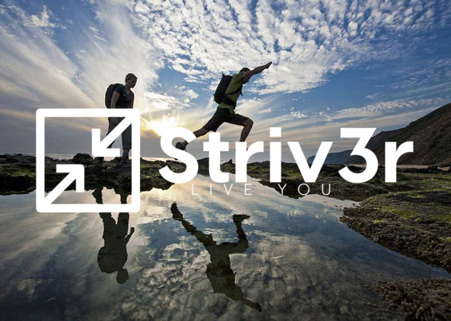

<!DOCTYPE html>
<html lang="en">
<head>
  <meta charset="utf-8">
  <title>Striv3r</title>
  <meta content="width=device-width, initial-scale=1.0" name="viewport">
  <meta content="" name="keywords">
  <meta content="" name="description">

  <!-- Favicons -->
  <link href="img/favicon.png" rel="icon">
  <link href="img/apple-touch-icon.png" rel="apple-touch-icon">
  <link rel="stylesheet" href="https://cdnjs.cloudflare.com/ajax/libs/font-awesome/4.7.0/css/font-awesome.min.css">

  <!-- Google Fonts -->
  <link href="https://fonts.googleapis.com/css?family=Open+Sans:300,300i,400,400i,700,700i|Poppins:300,400,500,700" rel="stylesheet">

  <!-- Bootstrap CSS File -->
  <link href="lib/bootstrap/css/bootstrap.min.css" rel="stylesheet">

  <!-- Libraries CSS Files -->
  <link href="lib/font-awesome/css/font-awesome.min.css" rel="stylesheet">
  <link href="lib/animate/animate.min.css" rel="stylesheet">

  <!-- Main Stylesheet Files -->
  <link href="css/modal.css" rel="stylesheet">

  <link href="css/style.css" rel="stylesheet">
  <link rel="stylesheet" href="https://cdnjs.cloudflare.com/ajax/libs/normalize/5.0.0/normalize.min.css">

  <!-- =======================================================
    Theme Name: Regna
    Theme URL: https://bootstrapmade.com/regna-bootstrap-onepage-template/
    Author: BootstrapMade.com
    License: https://bootstrapmade.com/license/
  ======================================================= -->
</head>

<body>
  <!--==========================
  Header
  ============================-->
  <header id="header">
    

      

        <!--<a href="#hero"></img></a>-->
        <!-- Uncomment below if you prefer to use a text logo
        <h1><a href="#hero">Striv3r</a></h1>-->
      

      <!--
      <nav id="nav-menu-container">
        <ul class="nav-menu">
          <li class="menu-active"><a href="#hero">Home</a></li>
          <li><a href="#about">About Us</a></li>
          <li><a href="#services">Services</a></li>
          <li><a href="#portfolio">Portfolio</a></li>
          <li><a href="#team">Team</a></li>
          <li class="menu-has-children"><a href="">Drop Down</a>
            <ul>
              <li><a href="#">Drop Down 1</a></li>
              <li class="menu-has-children"><a href="#">Drop Down 2</a>
                <ul>
                  <li><a href="#">Deep Drop Down 1</a></li>
                  <li><a href="#">Deep Drop Down 2</a></li>
                  <li><a href="#">Deep Drop Down 3</a></li>
                  <li><a href="#">Deep Drop Down 4</a></li>
                  <li><a href="#">Deep Drop Down 5</a></li>
                </ul>
              </li>
              <li><a href="#">Drop Down 3</a></li>
              <li><a href="#">Drop Down 4</a></li>
              <li><a href="#">Drop Down 5</a></li>
            </ul>
          </li>
          <li><a href="#contact">Contact Us</a></li>
        </ul>
      </nav><!-- #nav-menu-container -->
    

  </header><!-- #header -->

  <!--==========================
    Hero Section
  ============================-->
  <section id="hero">
    

      
      <h2>A truer you awaits</h2>
      <a href="#about" class="btn-get-started">Learn More</a>
      <a href="#" class="modal-button">I'm Interested</a>

    

  </section><!-- #hero -->

  <main id="main">

    <!--==========================
      About Us Section
    ============================-->
    <section id="about">
      

        

          

            <h2 class="title">About Us</h2>
            

              Our mission is to help you develop the mindset and habits you need to become your best self. We help you discover your intrinsic values and foster a growth mindset to live your life for you.
            

            

              
<i class="fa fa-list"></i>

              <h4 class="title">Planning</h4>
              

                Planning? It's the hardest part of achieving what you set out to accomplish. We build that custom, tailor-fitted plan with you. Better yet, we also hold you accountable and work to see what motivates you to see your goals through. Vacations? Health? A new hobby? You bet we'll get you there!​
              

            

            

              
<i class="fa fa-wifi"></i>

              <h4 class="title">Disconnect</h4>
              

                If you are like most of our clients you suffer from an addiction, or at least a distraction, via technology. Wonder where your day went... Instagram? Social Media? Emails? Netflix? We get you unplugged from tech, and reconnect you to what matters most.​
              

            

            

              
<i class="fa fa-users"></i>

              <h4 class="title">Community</h4>
              

                Community is everything. The more people you know involved in Striv3r, the better your experience will be (and YES we'll even PAY you for recruiting friends). We encourage community here at Striv3r, because we know it's what keeps us going when the going gets tough.
              

            

          

          

                
          

        

      

    </section><!-- #about -->

    <!--==========================
      Facts Section
    ============================
    <section id="facts">
      

        

          <h3 class="section-title">Facts</h3>
          
Sed ut perspiciatis unde omnis iste natus error sit voluptatem accusantium doloremque

        

        

  				

            12
            
Clients

  				

          

            521
            
Goals Met

  				

          

            1,463
            
Company Users

  				

          

            4
            
Leaders

  				

  			

      

    </section><!-- #facts

    <!--==========================
      Services Section
    ============================
    <section id="services">
      

        

          <h3 class="section-title">Fall For Our Strategies</h3>
          
Sed ut perspiciatis unde omnis iste natus error sit voluptatem accusantium doloremque

        

        

          

            

              
<a href=""><i class="fa fa-desktop"></i></a>

              <h4 class="title"><a href="">Track Your Status</a></h4>
              
Each day you’re encouraged to confirm completion of your set targets. We track your progress, then continue to update your growth. Once you reach certain milestones, you’ll level up and receive rewards.

            

          

          

            

              
<a href=""><i class="fa fa-bar-chart"></i></a>

              <h4 class="title"><a href="">We help you get there</a></h4>
              
Planning? It’s the hardest part of achieving what you set out for. We take care of that for you. Better yet we hold you accountable, and work to see what gets you where you want to go. Vacations? Health? A new hobby? You bet we’ll get you there!

            

          

          

            

              
<a href=""><i class="fa fa-paper-plane"></i></a>

              <h4 class="title"><a href="">Sed ut perspiciatis</a></h4>
              
Duis aute irure dolor in reprehenderit in voluptate velit esse cillum dolore eu fugiat nulla pariatur

            

          

          

            

              
<a href=""><i class="fa fa-photo"></i></a>

              <h4 class="title"><a href="">Magni Dolores</a></h4>
              
Excepteur sint occaecat cupidatat non proident, sunt in culpa qui officia deserunt mollit anim id est laborum

            

          

          

            

              
<a href=""><i class="fa fa-road"></i></a>

              <h4 class="title"><a href="">Nemo Enim</a></h4>
              
At vero eos et accusamus et iusto odio dignissimos ducimus qui blanditiis praesentium voluptatum deleniti atque

            

          

          

            

              
<a href=""><i class="fa fa-shopping-bag"></i></a>

              <h4 class="title"><a href="">Eiusmod Tempor</a></h4>
              
Et harum quidem rerum facilis est et expedita distinctio. Nam libero tempore, cum soluta nobis est eligendi

            

          

        

      

    </section><!-- #services -->

    <!--==========================
    Call To Action Section
    ============================
    <section id="call-to-action">
      

        

          

            <h3 class="cta-title">Call To Action</h3>
            
 Duis aute irure dolor in reprehenderit in voluptate velit esse cillum dolore eu fugiat nulla pariatur. Excepteur sint occaecat cupidatat non proident, sunt in culpa qui officia deserunt mollit anim id est laborum.

          

          

            <a class="cta-btn align-middle" href="#">Call To Action</a>
          

        

      

    </section><!-- #call-to-action -->

    <!--==========================
      Portfolio Section
    ============================
    <section id="portfolio">
      

        

          <h3 class="section-title">Portfolio</h3>
          
Sed ut perspiciatis unde omnis iste natus error sit voluptatem accusantium doloremque

        

        

          

            <ul id="portfolio-flters">
              <li data-filter=".filter-app, .filter-card, .filter-logo, .filter-web" class="filter-active">All</li>
              <li data-filter=".filter-app">App</li>
              <li data-filter=".filter-card">Card</li>
              <li data-filter=".filter-logo">Logo</li>
              <li data-filter=".filter-web">Web</li>
            </ul>
          

        

        

          

            <a href="">
              
              

                <h4>App 1</h4>
                Alored dono par
              

            </a>
          

          

            <a href="">
              
              

                <h4>Web 2</h4>
                Alored dono par
              

            </a>
          

          

            <a href="">
              
              

                <h4>App 3</h4>
                Alored dono par
              

            </a>
          

          

            <a href="">
              
              

                <h4>Card 1</h4>
                Alored dono par
              

            </a>
          

          

            <a href="">
              
              

                <h4>Card 2</h4>
                Alored dono par
              

            </a>
          

          

            <a href="">
              
              

                <h4>Web 3</h4>
                Alored dono par
              

            </a>
          

          

            <a href="">
              
              

                <h4>Card 3</h4>
                Alored dono par
              

            </a>
          

          

            <a href="">
              
              

                <h4>App 2</h4>
                Alored dono par
              

            </a>
          

          

            <a href="">
              
              

                <h4>Logo 1</h4>
                Alored dono par
              

            </a>
          

          

            <a href="">
              
              

                <h4>Logo 3</h4>
                Alored dono par
              

            </a>
          

          

            <a href="">
              
              

                <h4>Web 1</h4>
                Alored dono par
              

            </a>
          

          

            <a href="">
              
              

                <h4>Logo 2</h4>
                Alored dono par
              

            </a>
          

        

      

    </section><!-- #portfolio -->

    <!--==========================
      Team Section
    ============================-->

    <section id="team">
      

        

          <h3 class="team-title">What Our Clients Are Saying</h3>
        

        

          <!-- Kaylee's review-->
          

            

          

          

            <h6><i> "Blah Blah Blah Blah Blah Bla Blah Blah Bla Blah Blah Bla. Blah Blah Bla Blah Blah Bla.  Blah Blah Bla Blah Blah Bla. "<i></h6>
            <h6> - Kaylee Ver</h6>

          

          <!-- Rob's review -->
          

            

          

          

            <h6><i> "Blah Blah Blah Blah Blah Bla Blah Blah Bla Blah Blah Bla. Blah Blah Bla Blah Blah Bla.  Blah Blah Bla Blah Blah Bla. "<i></h6>
            <h6> - Rob Lawrenz</h6>

          

        

      

    </section><!-- #team -->

    <!--==========================
      Contact Section
    ============================
    <section id="contact">
      

        

          <h3 class="section-title">Join our Email List!</h3>
          
Striv3r is coming soon! Join our email list and one of our team members will be in contact with you.

        

        

          
Your message has been sent. Thank you!

          

          <form name="submit-to-google-sheet" class="contactForm">
            

              <input type="text" name="name" class="form-control" id="name" placeholder="Your Name" data-rule="minlen:4" data-msg="Please enter at least 4 characters" />
              

            

            

              <input type="email" class="form-control" name="email" id="email" placeholder="Your Email" data-rule="email" data-msg="Please enter a valid email" />
              

            

            

              <textarea class="form-control" name="message" rows="5" data-rule="required" data-msg="Please tell us about you" placeholder="Tell us your vision for yourself"></textarea>
              

            

            
<button type="submit">Submit</button>

          </form>
        

      

</section>

<!--
      

        

          

            

              

                <i class="fa fa-map-marker"></i>
                
A108 Adam Street New York, NY 535022

              

              

                <i class="fa fa-envelope"></i>
                
info@example.com

              

              

                <i class="fa fa-phone"></i>
                
+1 5589 55488 55s

              

            

            

              <a href="#" class="twitter"><i class="fa fa-twitter"></i></a>
              <a href="#" class="facebook"><i class="fa fa-facebook"></i></a>
              <a href="#" class="instagram"><i class="fa fa-instagram"></i></a>
              <a href="#" class="google-plus"><i class="fa fa-google-plus"></i></a>
              <a href="#" class="linkedin"><i class="fa fa-linkedin"></i></a>
            

          

          

            

              
Your message has been sent. Thank you!

              

              <form action="" method="post" role="form" class="contactForm">
                

                  <input type="text" name="name" class="form-control" id="name" placeholder="Your Name" data-rule="minlen:4" data-msg="Please enter at least 4 chars" />
                  

                

                

                  <input type="email" class="form-control" name="email" id="email" placeholder="Your Email" data-rule="email" data-msg="Please enter a valid email" />
                  

                

                

                  <input type="text" class="form-control" name="subject" id="subject" placeholder="Subject" data-rule="minlen:4" data-msg="Please enter at least 8 chars of subject" />
                  

                

                

                  <textarea class="form-control" name="message" rows="5" data-rule="required" data-msg="Please write something for us" placeholder="Message"></textarea>
                  

                

                
<button type="submit">Submit</button>

              </form>
            

          

        

      

    </section><!-- #contact -->

    <!--==========================
      Bottom Hero Section
    ============================
    <section id="bottomhero">
      

        <h2 class="title">Reviews</h2>

      

    </section><!-- #hero -->

<!-- Section for email signup -->

  

    

      

        <form name="submit-to-google-sheet" class="contactForm">
          <h1 class="modal-title">Join our Email list!</h1>
          
Striv3r is coming soon! Join our email list and one of our team members will be in contact with you.

          

            <label for="name" class="input-label">Name</label>
            <input type="text" name="name" id="name" placeholder="Name" required>
            

          

          

            <label for="email" class="input-label">Email</label>
            <input type="email" name="email" id="email" placeholder="Email" required>
            

          

          

            <button class="submit-button" data-dismiss="modal">Submit</button>
          

      </form>
    

  

    

      
    

    <button class="icon-button close-button">
        <svg xmlns="http://www.w3.org/2000/svg" viewBox="0 0 50 50">
          <path d="M 25 3 C 12.86158 3 3 12.86158 3 25 C 3 37.13842 12.86158 47 25 47 C 37.13842 47 47 37.13842 47 25 C 47 12.86158 37.13842 3 25 3 z M 25 5 C 36.05754 5 45 13.94246 45 25 C 45 36.05754 36.05754 45 25 45 C 13.94246 45 5 36.05754 5 25 C 5 13.94246 13.94246 5 25 5 z M 16.990234 15.990234 A 1.0001 1.0001 0 0 0 16.292969 17.707031 L 23.585938 25 L 16.292969 32.292969 A 1.0001 1.0001 0 1 0 17.707031 33.707031 L 25 26.414062 L 32.292969 33.707031 A 1.0001 1.0001 0 1 0 33.707031 32.292969 L 26.414062 25 L 33.707031 17.707031 A 1.0001 1.0001 0 0 0 32.980469 15.990234 A 1.0001 1.0001 0 0 0 32.292969 16.292969 L 25 23.585938 L 17.707031 16.292969 A 1.0001 1.0001 0 0 0 16.990234 15.990234 z"></path>
        </svg>
    </button>
  

<!-- Scripts to submit sign up form to google sheets -->
  
  
  

  </main>

  <!--==========================
    Footer
  ============================-->
  <footer id="footer">
    

      

      

    

    

      

        &copy; Copyright <strong>Regna</strong>. All Rights Reserved
      

      

        <!--
          All the links in the footer should remain intact.
          You can delete the links only if you purchased the pro version.
          Licensing information: https://bootstrapmade.com/license/
          Purchase the pro version with working PHP/AJAX contact form: https://bootstrapmade.com/buy/?theme=Regna
        -->
        Designed by <a href="https://bootstrapmade.com/">BootstrapMade</a>
      

    

  </footer><!-- #footer -->

  <a href="#" class="back-to-top"><i class="fa fa-chevron-up"></i></a>

  <!-- JavaScript Libraries -->
  
  
  
  
  
  
  
  
  

  <!-- Contact Form JavaScript File -->
  

  <!-- Template Main Javascript File -->
  
  

</body>
</html>
